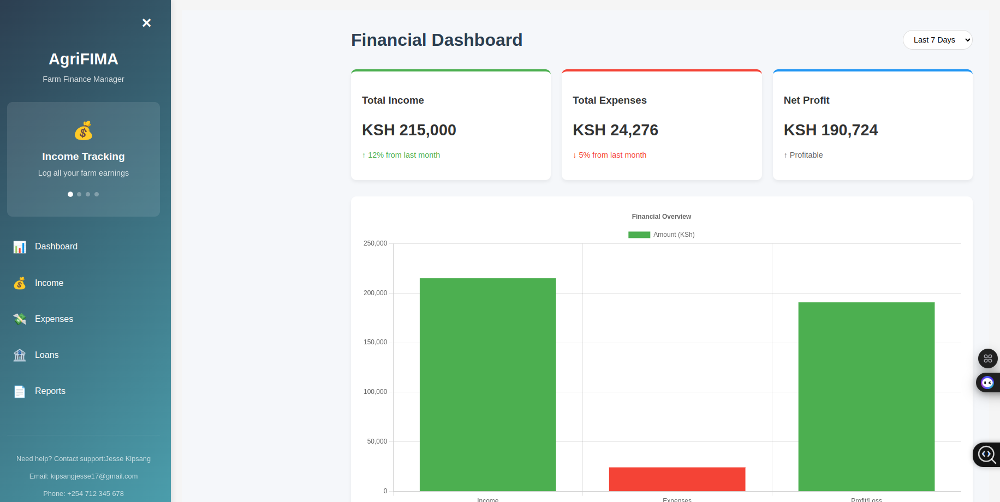

# Agri-Finance Tracker

A React application for small-scale farmers to track income, expenses, and explore loan options.

## Features
- Income tracking with multiple fields
- Expense tracking with categories
- Profit/Loss calculation
- Loan options display
- Financial report generation
- Data visualization

## Setup

1. Clone the repository
2. Install dependencies: `npm install`
3. Start the development server: `npm start`
4. In another terminal, start the mock API server: `npm run server`

## Deployment

### Local Development
1. Run `npm install` to install dependencies
2. Start both React app and JSON server:
   ```bash
   npm start
   npm run server
   ```
3. Access app at `http://localhost:3000`
4. API endpoints at `http://localhost:3001`

### Vercel Deployment
1. Install Vercel CLI: `npm install -g vercel`
2. Build your project: `npm run build`
3. Deploy: `vercel`
4. Set environment variables for API endpoints if needed

## Mock API Endpoints
- GET `/incomes` - Fetch all income records
- POST `/incomes` - Add new income
- GET `/expenses` - Fetch all expense records
- POST `/expenses` - Add new expense
- GET `/loans` - Fetch available loan options

## Project Structure
- `src/api/` - API service functions
- `src/components/` - React components
- `src/context/` - State management
- `src/utilis/` - Helper functions
- `db.json` - Mock database
- `src/context/` - Handling context

## Web Page screenshot



